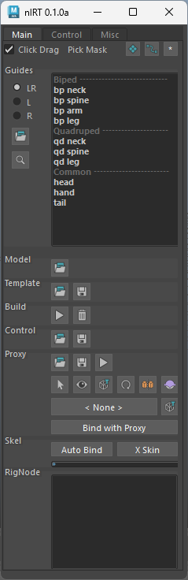
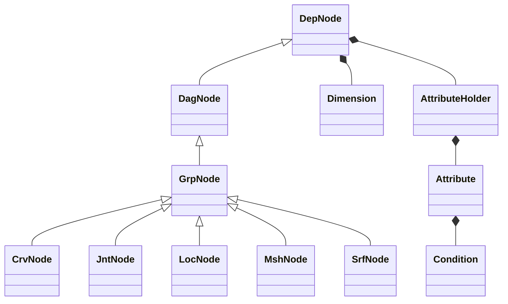
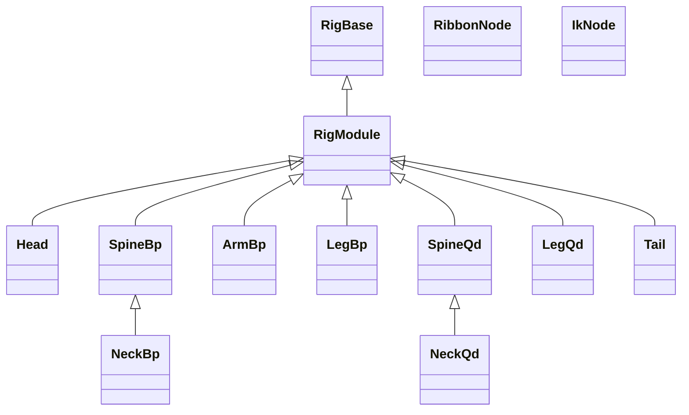

# nl-rigging-tools ( nlRT )    

 

## Background
Once in a while I used the Ziva muscle plugin intensively in a project. There was a challenging process of rigging the actual skeleton meshes. I feel that it would be a good opportunity to learn anatomy while building a helpful tool to rig any vertebral animal in the future.

## Features

- **Modular**: Supports characters with any number of parts.
- **Data Reuse**: Save and restore templates, controls, and proxies.
- **Auto Connect/Bind**: Components and skeletal meshes are automatically connected and bound.
- **Marking Menus**: Speed up rigging with custom marking menus.
- **Concise Python code**: For easy extension.

## Framework Python Classes

## Component Python Classes

## Marking menus
Two Marking menus are made to speed up rigging work.
|Menu|Shortcut|Interface|
|:-:|:-:|:-:|
|Rig Building |Ctrl + MMB||
|Daily Rigging Operations|Ctrl + Alt + MMB| |

## Development Environment
| Maya | Python | OS |
|:-:|:-:|:-:|
|2023.3 |3.9.7|Win 11

The tool might work in 2022, but it is not tested.
## Installation

1. Download and extract repository
2. In Maya, go to the shelf you want to have the icon added
3. Drag and drop "install/dragAndDrop.py" onto viewport
4. Click the icon to show the UI

## Reference
1. [BoneClones](https://boneclones.com/category/all-zoology-skeletons/fields-of-study)

2. [Python for Maya : Beginner to Advanced Rigging Automation by Nick Hughes](https://www.udemy.com/course/python-for-maya-beginner-to-advanced-rigging-automation)

## More Info

Visit my blog: [www.nickyliu.com](http://www.nickyliu.com)
