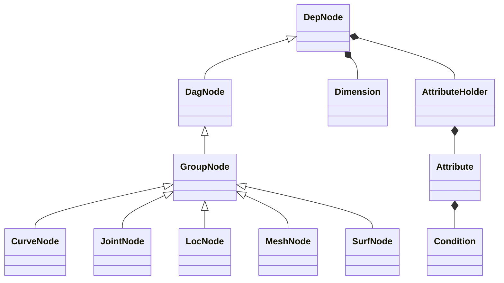
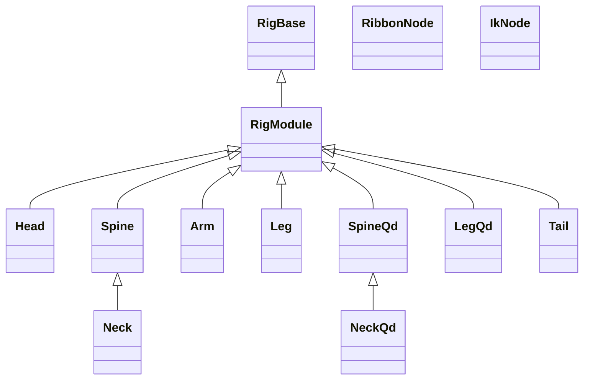

# nl-rigging-tools (nRT)
### What ?
It is another open-source modular auto-rigger written for Autodesk Maya in Python.

There are a few great auto-rigger tools available freely online. As a rigger I'm interested in building my own. One cool thing I learn throughout the development is the use of custom framework. Thanks to the Udemy course <b>Python for Maya: Beginner to Advanced Rigging Automation</b> by <b>Nick Hughes</b>, my code is less redundant, easier to read, and not dependent on PyMEL.

e.g. the codes below generate all utility nodes and connections, and read like expression.

```python
# ---------------
#    Soft IK
# ---------------
s = self.ikc.a.softIK
Ds = D * (1 - s)
ds = D * (1 - s * math.e ** -(d - Ds))
(((d > Ds).setCdn(ifTrue=ds, ifFalse=d)) * ratio >> softJ.a.tx)
```

## Framework Classes



Examples
```python
# create curve with cube shape and offset group
ctl = CurveNode("myCrv", shape="cube", addOfs=1)

# create joint of radius=2 and parented to ctl
jnt = JointNode("myJnt", r=2, p=ctl)

# create locator of size=3, aligned to ctl, parented to jnt
loc = LocNode("myLoc", size=3, align=ctl, p=jnt)
```


## Component Classes


## Rig Features
General
* Scalable

Biped Limbs
* fk ik switch
* squash & stretch
* space switch
* soft ik
* smart ctl
* elbow & knee pin with fk ctl
* auto aim for hip & clavicle
* palm roll & bank for both fk ik
* -------- ( Optional ) --------
* ribbon ctl
* twist bones
* patella bone
* toe bones
* knee correction

Biped Spine
* hybrid fk ik
* squash & stretch
* lower hip ctl
* volume ctl

Quad Limbs
* fk ik switch
* squash & stretch
* space switch
* -------- ( Optional ) --------
* twist bones
* patella bone
* toe bones
* wrist correction

## Marking Menus

Two marking menus are included with shortcut.

#### Rig Operation ( ctrl + MMB )


#### General Rigging ( ctrl + alt + MMB )


## Installation
1. Download the repository zip file.
2. Extract to storage location.
3. Locate install/dragAndDrop.py.
4. Drag and drop it onto a Maya viewport.


## Usage

```python
from nl_modules import nl_rigging_tools
nl_rigging_tools.main()
```
## To do

* Study matrix for more efficient constraint calculation.
* Understand more about how professional animators work.