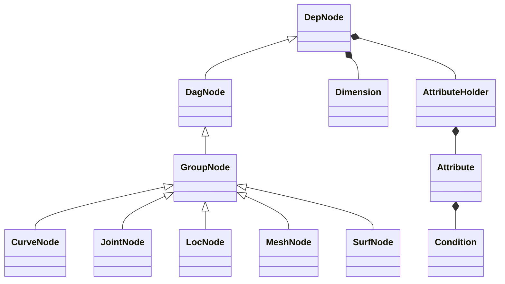
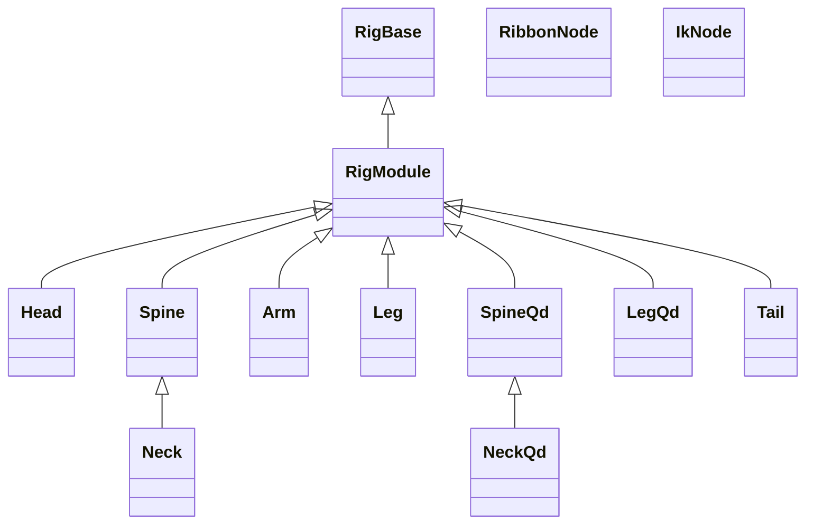

# nl-rigging-tools

## Background
For years, I have been rigging characters with my own autorigger . Once in a project I was using Ziva and find it interesting rigging the actual "skeleton". Menawhile I would like to apply python and anatomy through the project.

## Overview

nl-rigging-tools is designed with minimum setup time and maximum usability.
- <b>Modular : </b>
I'm tired of building entire rig and deleting unwanted parts.
- <b>Custom Framework : </b>
Thanks to the course "Python for Maya: Beginner to Advanced Rigging Automation" by Nick Hughes, I learn to build tools without PyMel 
- <b>Auto Skinning </b>


## Framework Python Classes


## Component Python Classes



## Components Features

Part | FK | IK | Ribbon | Stretchy | Volume | Soft Ik | Pv Pin | Twist bones | Palm Roll | Patella Bone | Local Scaling
--- | --- | --- | --- | --- | --- | --- | --- | --- | --- | --- | --- 
Head |+||||||||||+
Spine |+|+|+|+|+||||+
Hand |+|+|+|+|||||||+
Arm |+|+|+|+|+|+|+|+|||+
Leg |+|+|+|+|+|+|+|+|+|+|+
Tail |+|+|+|+|||||||+


## Marking menus
Two Marking menus are made to speed up rigging work.
|||
|---|---|
|Rig Building | Ctrl + MMB |
|Daily Rigging Operations | Ctrl + Alt + MMB |


## Installation
1. Download the repository zip file.
2. Extract it.
3. Locate install / dragAndDrop.py.
4. Drag and drop it onto a Maya viewport.
5. Run the lines
    ```python
    from nl_modules import nl_rigging_tools
    nl_rigging_tools.main()
    ```

## More Info
Please visit my blog at [www.nickyliu.com](http://www.nickyliu.com)


## Reference
[BoneClones](https://boneclones.com/category/all-zoology-skeletons/fields-of-study)