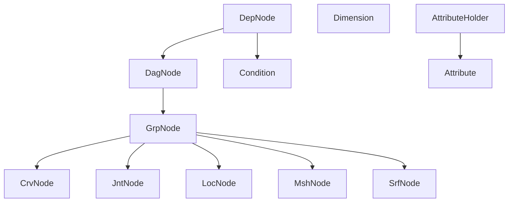
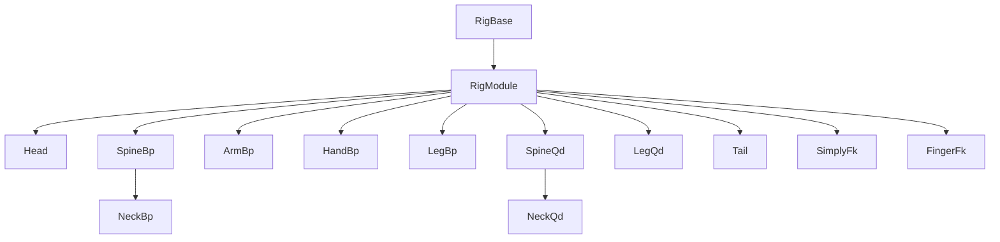
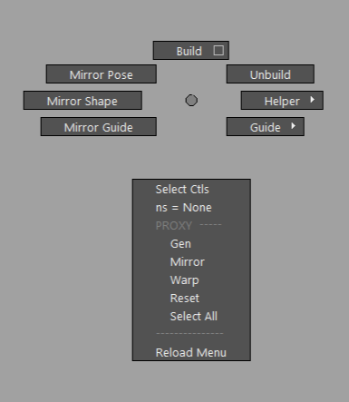
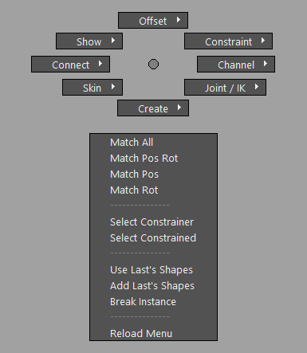
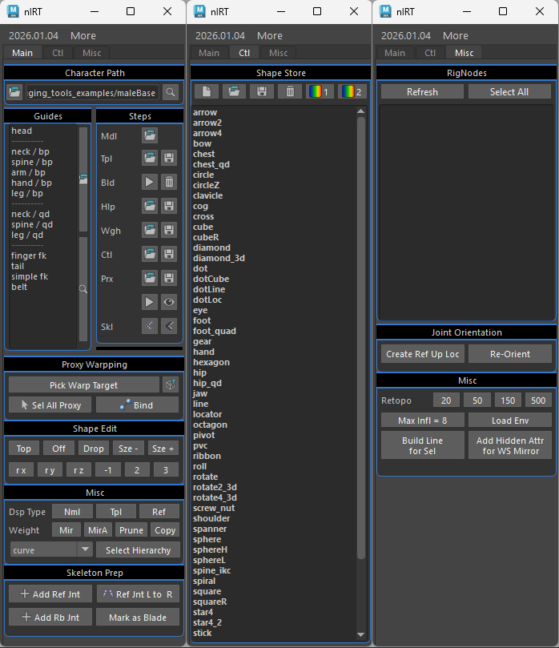

<!--

-->

# nl-rigging-tools ( nlRT )    

## Background

In my last job I encountered a project with characters involving Ziva muscle setup. The very first step was to rig the skeleton mesh  as an input of simulation. It required unusal skill that was inspirating to me. Wouldn't it be great to build an autorig tool for every vetebra on Earth ?

## Features

- **Modular :** Support multiple limbs.
- **Skeletal Build :** Support skeleton rigging.
- **Cartoony Build :** Support bendy limbs.
- **Data Reuse :** Reuse of templates, controls, proxies, weights.
- **Custom Marking Menus :** Handy menus for rig creation.
- **Custom Framework :** Less redundant code for rig development.

## Framework Classes

## Component Classes

## Marking menus
Two Marking menus are made to speed up rigging tasks.
|Menu|Shortcut|Interface|
|:-:|:-:|:-:|
|Rig Build |Ctrl + MMB||
|General|Ctrl + Alt + MMB| |

## Development Environment
| Maya | Python | OS |
|:-:|:-:|:-:|
|2023.3 |3.9.7|Win 11

## Installation

1. Download and extract to your target location.
2. Drag and drop "nl_rigging_tools_drag.py" onto Maya. "nlRT" will be added into main menu and the tool UI will show up.

You can add icon to the active shelf by "More > Add Icon to Current Shelf" in the tool UI.

## Usage

 

Firstly, files are read with the naming convention like below

`(char)`  
&emsp;`  |_ mdl`  
&emsp;&emsp;&emsp;`    |_ (char)_mdl*.ma`  
&emsp;`  |_ weight`  
&emsp;&emsp;&emsp;`  |_ (char)_wgh*.json`  
&emsp;`  |_ (char)_tpl*.json`  
&emsp;`  |_ (char)_ctl*.ma`  
&emsp;`  |_ (char)_prx*.ma`  

Typical Workflow
1. Browse the character directory.
2. Create guide components or load from saved.
3. Build rig.
4. To bind character with proxy, gen proxy, edit and bind . Otherwise bind manually.
5. Edit ctl shapes.

## Reference
1. [Python for Maya : Beginner to Advanced Rigging Automation by Nick Hughes](https://www.udemy.com/course/python-for-maya-beginner-to-advanced-rigging-automation)
2. [Ramon Arango's rigs](https://ramonarango.gumroad.com/)
2. [BoneClones](https://boneclones.com/category/all-zoology-skeletons/fields-of-study)
3. [Ivlpaleontology](https://sketchfab.com/ivlpaleontology)

##
For more details, visit my blog at [https://www.nickyliu.com](https://www.nickyliu.com)
