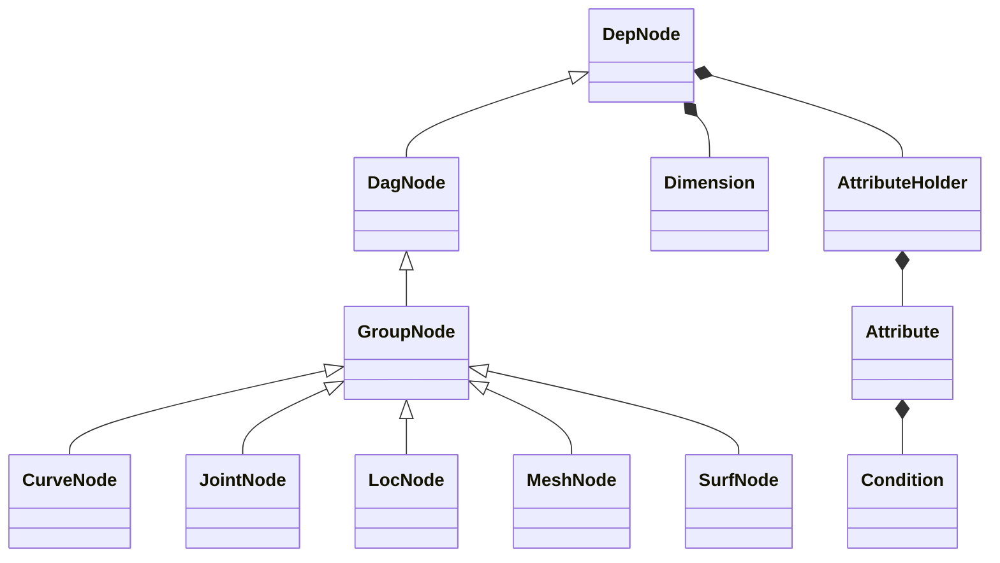
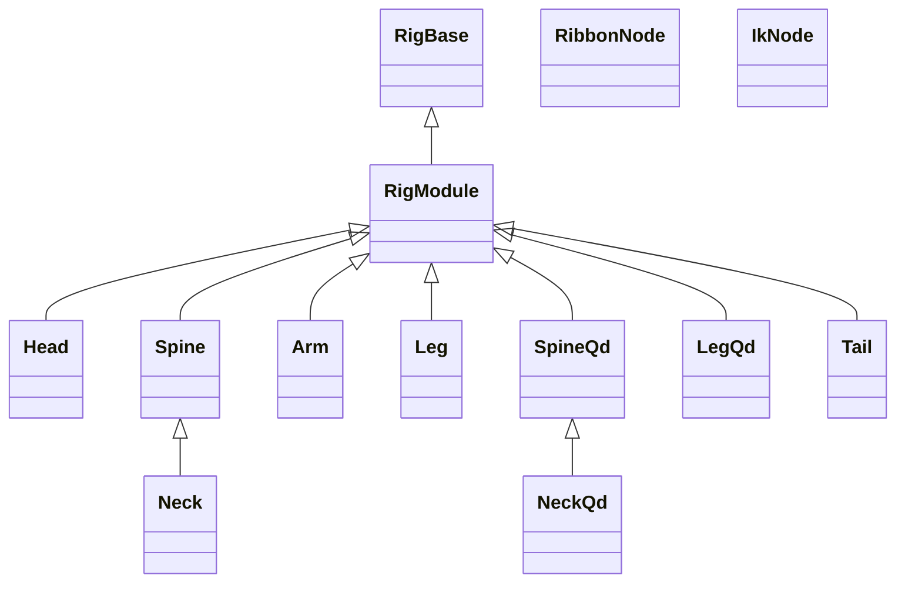
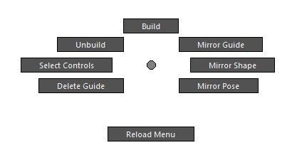
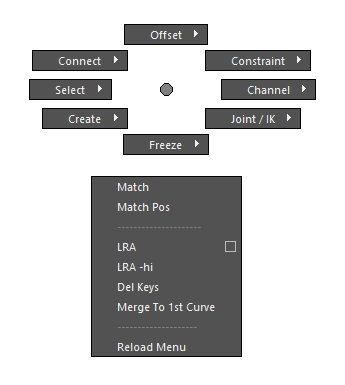

# nl-rigging-tools

## Background
Ages ago I used Ziva intensively in a project. It involves a process of rigging the actual skeletonal meshes. It's a good opportunity to learn anatomy and to make a tool to automate it for more that one species effectively. Meanwhile I hope it's not too late to go for python instead of the limiting Mel/Maxscipt.

## Overview

nl-rigging-tools is designed with the following key features in mind :
- <b>Modular : </b>Character can have any number of parts/
- <b>Auto Connect : </b> Parts are connected automatically according to distance between anchors.
- <b>Data Reuse : </b> Guide templates, proxies, and control shapes can be saved and restored.
- <b>Custom Framework : </b> Thanks to Nick Hughes' Udemy course, "Python for Maya: Beginner to Advanced Rigging Automation" I learn a better way of development and building concise code.
- <b>Auto Bind : </b> Speed up binding for skeletal meshes using ref / ribbon joints


## Framework Python Classes


## Component Python Classes



## Components Features

Part | FK | IK | Ribbon | Stretchy | Volume | Soft Ik | Pv Pin | Twist bones | Palm Roll | Patella Bone 
--- | --- | --- | --- | --- | --- | --- | --- | --- | --- | --- 
Head |+|||||||||
Spine |+|+|+|+|+|||
Hand |+|+|+|+||||||
Arm |+|+|+|+|+|+|+|+||
Leg |+|+|+|+|+|+|+|+|+|+
Tail |+|+|+|+||||||


## Marking menus
Two Marking menus are made to speed up rigging work.
|Menu|Shortcut|UI|
|---|---|---|
|Rig Building |Ctrl + MMB||
|Daily Rigging Operations|Ctrl + Alt + MMB| |


## Installation
1. Download the repository zip file.
2. Extract it.
3. Locate install / dragAndDrop.py.
4. Drag and drop it onto a Maya viewport.
5. Run the lines
    ```python
    from nl_modules import nl_rigging_tools
    nl_rigging_tools.main()
    ```

## More Info
Please visit my blog at [www.nickyliu.com](http://www.nickyliu.com)


## Reference
[BoneClones](https://boneclones.com/category/all-zoology-skeletons/fields-of-study)