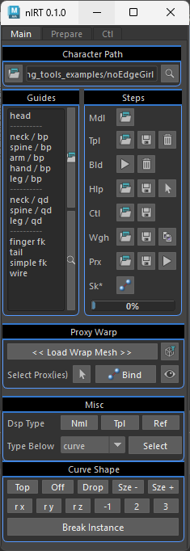
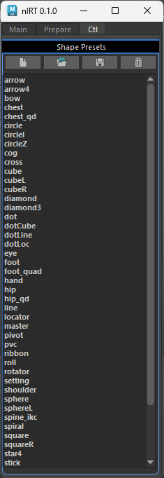
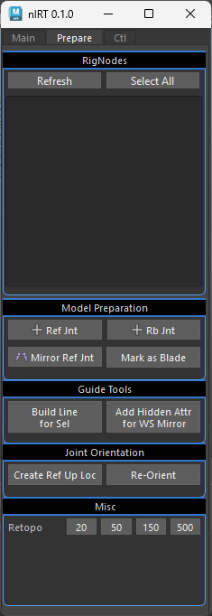
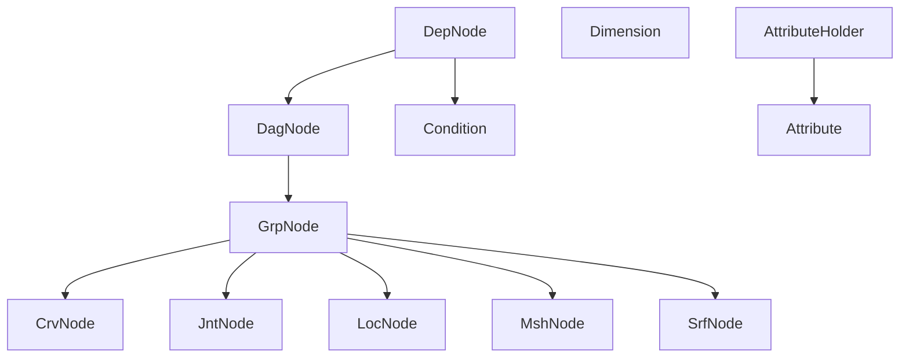
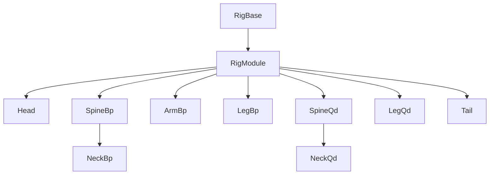

<!--

-->

# nl-rigging-tools ( nlRT )    

 
 
 

## Background
While working intensively on a project that involving Ziva muscle plugin, I had to rig the skeleton meshes first. This experience inspired me to create a tool that could automates the process, in addition to the cartoony features.

## Features

- **Modular**: Supports characters with multiple parts/limbs.
- **Data Reuse**: Restorable templates, controls, and proxies.
- **Auto Connect**: Common limbs are auto connected
- **Marking Menus**: Custom marking menus for the rig and rigging tasks.
- **Custom Framework**: Faster and more readable coding.
- **Skeletal Setup**: 

## Framework Classes

## Component Classes

## Marking menus
Two Marking menus are made to speed up rigging tasks.
|Menu|Shortcut|Interface|
|:-:|:-:|:-:|
|Rig Building |Ctrl + MMB||
|Daily Rigging Operations|Ctrl + Alt + MMB| |

## Development Environment
| Maya | Python | OS |
|:-:|:-:|:-:|
|2023.3 |3.9.7|Win 11

## Installation

1. Download and extract to your target location.
2. Click to the shelf you want the tool icon to add.
3. Drag and drop "nl_rigging_tools_drag.py" into Maya.

## Reference
1. [BoneClones](https://boneclones.com/category/all-zoology-skeletons/fields-of-study)
2. [ivlpaleontology](https://sketchfab.com/ivlpaleontology)
3. [Python for Maya : Beginner to Advanced Rigging Automation by Nick Hughes](https://www.udemy.com/course/python-for-maya-beginner-to-advanced-rigging-automation)

##
For more details, visit my blog at [https://www.nickyliu.com](https://www.nickyliu.com)
