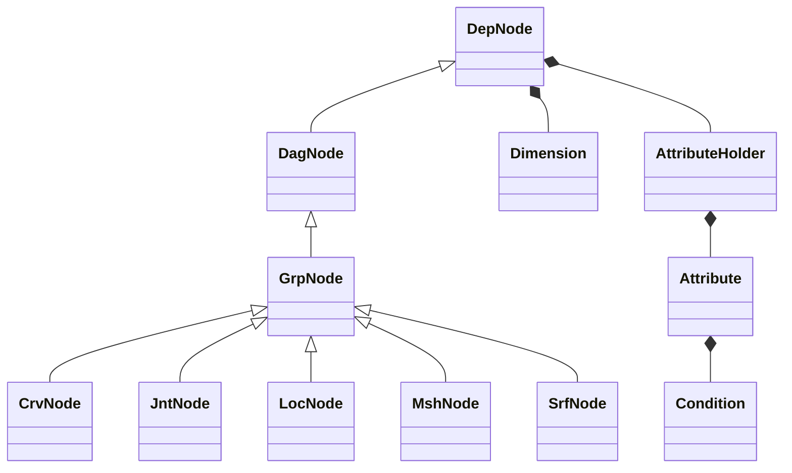
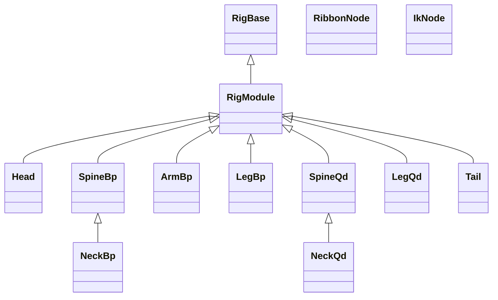

# nl-rigging-tools ( nlRT ) 
 

[](LICENSE)
[](http://www.nickyliu.com)


## Background
Once in a while I used the Ziva muscle plugin intensively in a project. There was a challenging process of rigging the actual skeleton meshes. I feel that it would be a good opportunity to learn anatomy while building a helpful tool to rig any vertebral animal in the future.

## Prerequisites

- Maya 2023 +
- Python 3.9 +

## Quick Start

1. Download and extract repository
2. In Maya, drag and drop "install/dragAndDrop.py" onto viewport
3. Run below in the script editor
```python
from nl_modules import nl_rigging_tools
nl_rigging_tools.main()
```

## Features

- **Modular**: Supports characters with any number of parts.
- **Data Reuse**: Save and restore templates, controls, and proxies.
- **Auto Connect/Bind**: Parts and skeletal meshes are automatically connected and bound.
- **Marking Menus**: Speed up rigging with custom marking menus.
- **Concise, Python code** for easy extension.


## Overview
nlRT is designed with the key features below :
- <b>Modular : </b>Support character of any number of parts.
- <b>Data Reuse : </b> Templates, controls and proxies can be saved and retored.
- <b>Auto Connect : </b> Parts are automatically connected  according to distance between anchors.
- <b>Auto Bind : </b> Skeletal meshes are auto bound with ref or ribbon joints added.
- <b>Concise code : </b> Thanks to , I use my own framework to make tools development more efficient.

## Framework Python Classes


## Component Python Classes



## Marking menus
Two Marking menus are made to speed up rigging work.
|Menu|Shortcut|Capture|
|---|---|---|
|Rig Building |Ctrl + MMB||
|Daily Rigging Operations|Ctrl + Alt + MMB| |

## FAQ

- Q: Maya throws an ImportError...
- A: Ensure `nl_modules` is in your Maya scripts path.

## Reference
1. [BoneClones](https://boneclones.com/category/all-zoology-skeletons/fields-of-study)

2. [Python for Maya : Beginner to Advanced Rigging Automation by Nick Hughes](https://www.udemy.com/course/python-for-maya-beginner-to-advanced-rigging-automation)

## More Info

Visit my blog: [www.nickyliu.com](http://www.nickyliu.com)
