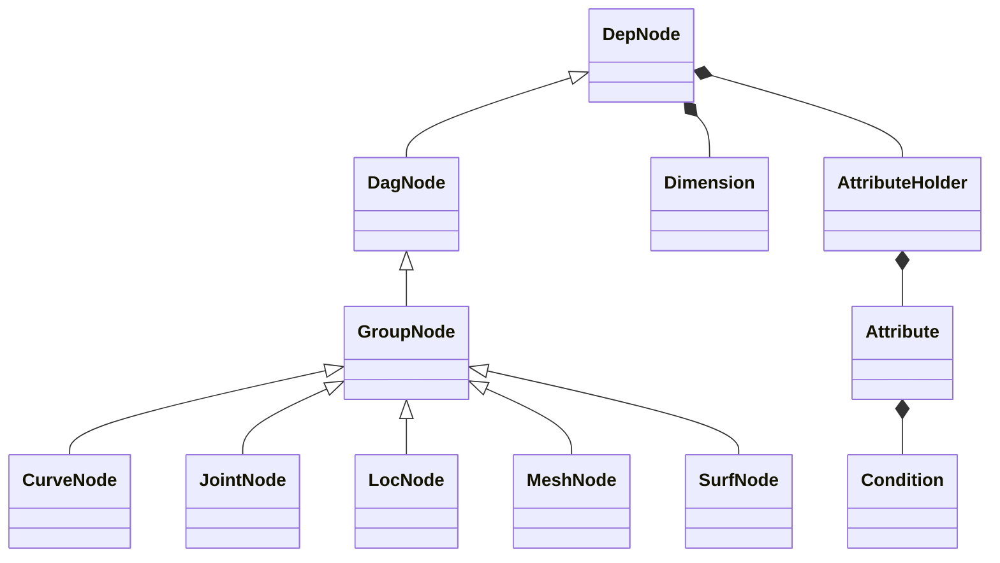
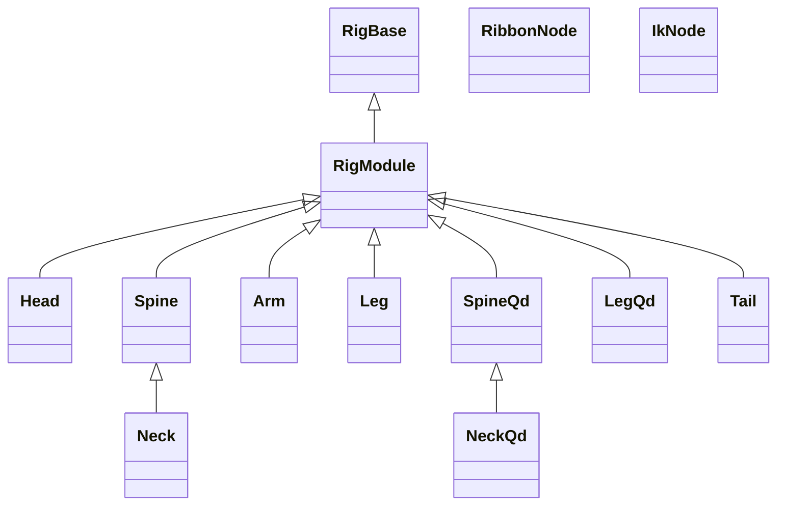

# nl-rigging-tools (NRT)
### What ?
There are a few great auto-rigging tools available freely online. As a rigger I'm interested in building my own. 

One thing I learn throughout the development is the use of custom framework. Thanks to the Udemy course <b>"Python for Maya: Beginner to Advanced Rigging Automation"</b> by Nick Hughes, I learn to write codes that is more concise, easier to read, while independent on PyMEL.

The lines below generate all utility nodes and connections, and read like expression.

```python
# ---------------
#    Soft IK
# ---------------
s = self.ikc.a.soft
Ds = D * (1 - s)
ds = D * (1 - s * math.e ** -(d - Ds))
(((d > Ds).setCdn(ifTrue=ds, ifFalse=d)) * ratio >> softJ.a.tx)
```

## Rig Features
General
* Modular build / unbuild
* Scalable

Spine
* hybrid fk/ik
* squash/stretch
* lower hip ctl
* volume ctl

Limbs
* fk/ik
* squash/stretch
* space switch
* auto clavicle/hip
* soft ik ( biped )
* smart ctl ( biped )
* palm roll/bank ( biped )
* elbow/knee pin with fk ctl ( biped )
* -------- ( Optional ) --------
* twist bones
* patella bone
* toe bones
* knee correction
* ribbon ctl ( biped )


## Framework Classes


<br>Examples
```python
loc = LocNode('myLoc', size=5, addOfs=1)
crv = CurveNode('myCrv', shape='cube', color=Color.RED, p=loc)

# Result :
#
#   myLoc_ofs       <- offset group
#       myLoc       <- locator with local scale = 5
#           myCrv   <- cube shape curve with color red
#
```

## Component Classes



## Marking Menus

#### Rig Operation ( ctrl + MMB )

#### General Rigging ( ctrl + alt + MMB )


## Installation
1. Download the repository zip file.
2. Extract to storage location.
3. Locate install/dragAndDrop.py.
4. Drag and drop it onto a Maya viewport.
5. Run the lines below
    ```python
    from nl_modules import nl_rigging_tools
    nl_rigging_tools.main()
    ```

## To do

* Study matrix for more efficient constraint calculation.
* Understand more about how professional animators work.
* Visit my blog at [nickyliu.com](http://www.nickyliu.com) for more info.