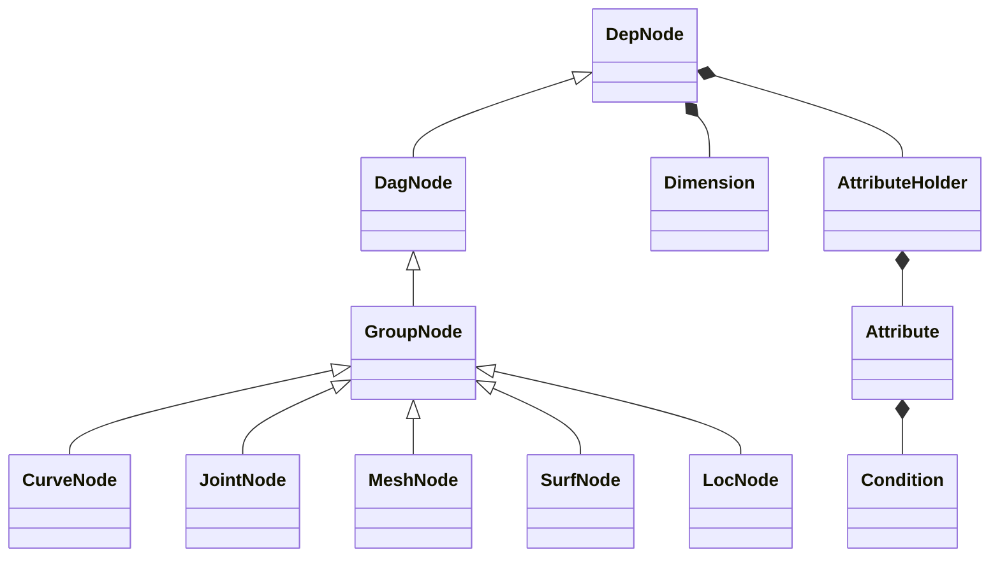
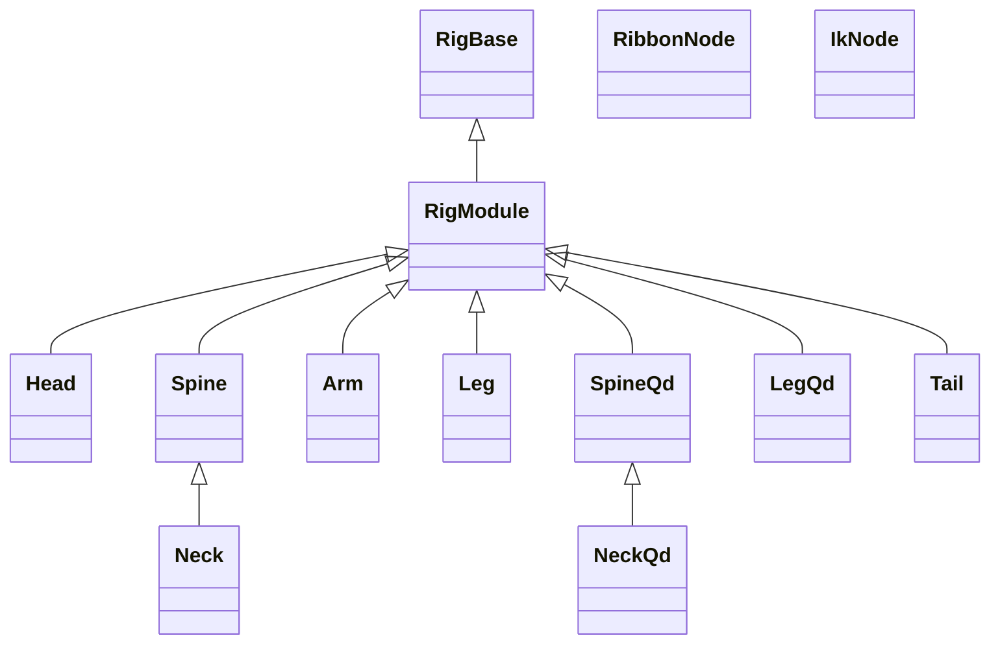

# nl-rigging-tools (nRT)
### What ?
It is another open-source modular auto-rigger written for Autodesk Maya in Python.

There are a few great auto-rigger tools available freely online. As a rigger I'm interested in building my own. One cool thing I learn throughout the development is the use of custom framework. Thanks to the Udemy course <b>Python for Maya: Beginner to Advanced Rigging Automation</b> by <b>Nick Hughes</b>, my tools could be built with less redundant code, better readability, and no dependency on PyMEL.

For example, the lines below generates all utility nodes and connections required and read as easily as expression !

```python
# ---------------------------------------------------------------
#    Soft ik logic
# ---------------------------------------------------------------
s = self.ikc.a.softIK
Ds = D * (1 - s)
new_d = D * (1 - s * math.e ** -(d - Ds))
(((d > Ds).setCdn(ifTrue=new_d, ifFalse=d)) * ratio >> softJ.a.tx)
```

## Framework Classes


    DepNode *-- AttributeHolder
    AttributeHolder *-- Attribute
    Attribute *-- Condition
    DepNode *-- Dimension

Examples
```python
# create curve with cube shape and offset group
ctl = CurveNode("myCrv", shape="cube", addOfs=1)

# create joint of radius=2 and parented to ctl
jnt = JointNode("myJnt", r=2, p=ctl)

# create locator of size=3
loc = LocNode("myLoc", size=3)

# pointConstraint loc to ctl
ctl.cstPoi(loc)

# loc.r = ctl.r * 2
ctl.a.r * (2,2,2) >> loc.a.r
```


## Component Classes


## Rig Features
Limb Basic
1. fk/ik switch
2. squash/stretch
3. space switch
4. soft ik
5. smart ctl
6. pv pin with fk ctl
7. auto hip/shoulder

Limb Options
1. ribbon ctl
2. fore limb twist bone
3. patella bone (leg)
4. toe bones (leg)
5. knee correction (leg)

## Marking Menus

Two marking menus are included with shortcut.

#### Rig Operation ( ctrl + MMB )


#### General Rigging ( ctrl + alt + MMB )


## Installation
1. Download the repository zip file.
2. Extract to storage location.
3. Locate install/dragAndDrop.py.
4. Drag and drop it onto a Maya viewport.


## Usage

```python
from nl_modules import nl_rigging_tools
nl_rigging_tools.main()
```
## To do

* Study matrix for more efficient constraint calculation.
* Understand more about how professional animators work.