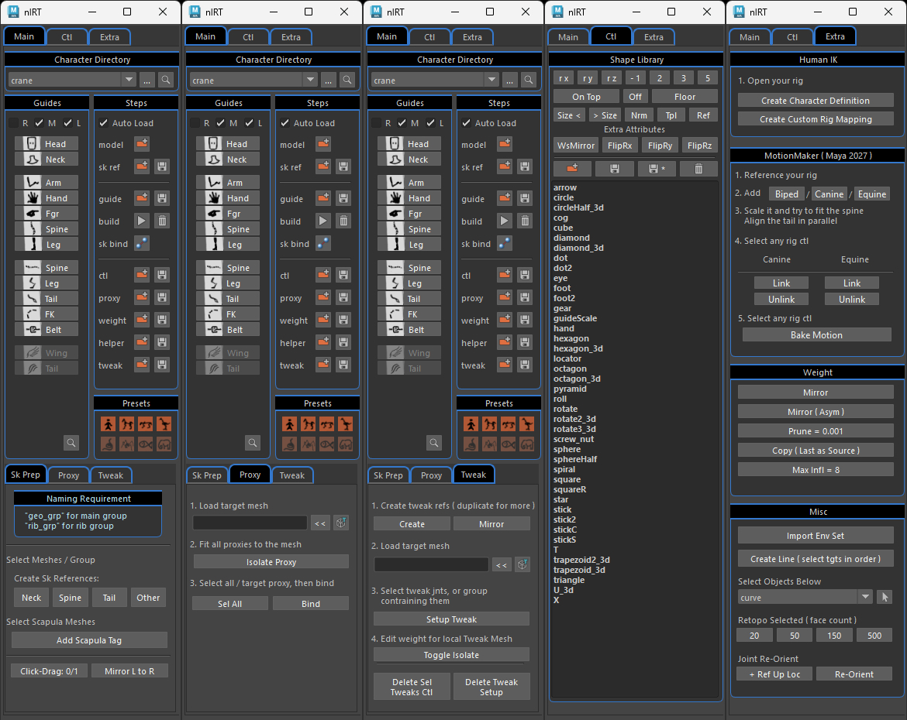
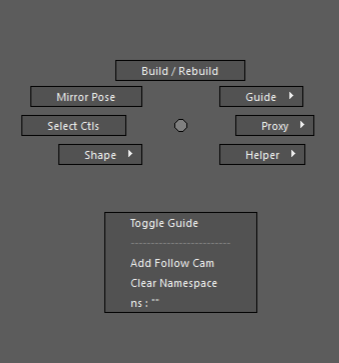
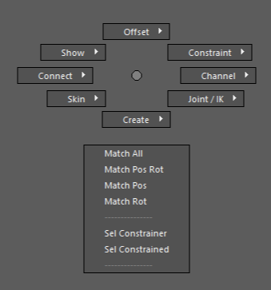
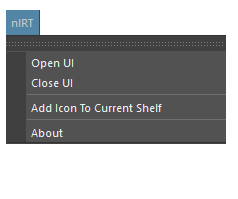
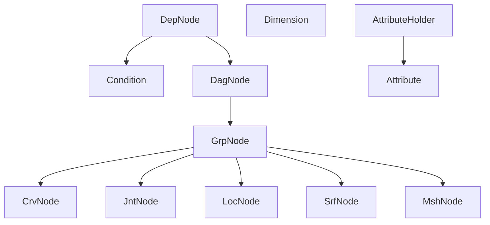
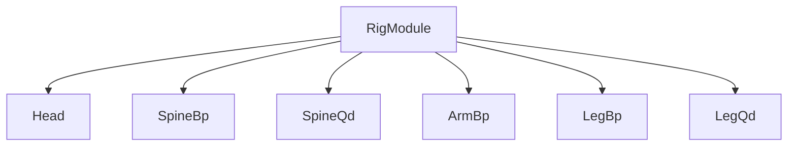
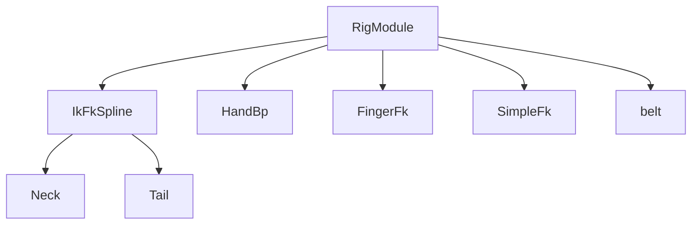

<!--
<style>
table {
    border-collapse: collapse;
}
table, th, td {
   border: 2px solid black;
}
blockquote {
    border-left: solid blue;
	padding-left: 10px;
}
</style>
-->

# nl-rigging-tools ( nlRT )


[](http://www.nickyliu.com)

 

## Declaimer
> Note that the project is still under active development so please use it for study purpose. 

## Background

In my last job I encountered a project involving character setup with Ziva muscle. The very first step was to rig the skeleton mesh as the input of simulation. It required unusual skills like creating IK with backward initial knee, bone adjustment to make it anatomically correct... Isn't it cool to have an autorig tool supporting skeletal rigging for every vetebrate ? It seems a great way to learn anatomy and apply python fully.


## Features

- **Modular :** multiple limbs.
- **Skeletal :** skeleton meshes for simulation.
- **Cartoony :** bendy limbs.
- **Data Reuse :** Reuse of presets, controls, proxies, weights and more
- **Custom Marking Menus :** Handy menus for rig creation.
- **Custom Framework :** Less redundant code.

## Marking Menus

|Rig Build|General|
|:-:|:-:|
|Ctrl + MMB|Ctrl + Alt + MMB|
|||

## Installation

1. Download and extract to somewhere you could keep the files.
2. Find "install_by_drag_n_drop.py" and drag it onto Maya viewport.

The tool UI will show up at the left and "nlRT" appears in the main menu of Maya.



## Usage

Typical Workflow :
1. Set Character Directory.
2. Load character model. (`*_mdl#.ma`)
3. For character with skeletal meshes, create rb joints bones in the middle and ref joints for limb bones. (`*_skl#.ma`) 
4. Add guides or presets. Fit the guide points to the model. (`*_tpl#.json`)
5. Build the rig.
6. If you want to bind using proxies, fit the proxy to warp mesh. (`*_prx#.ma`)
7. Smooth and fix skin weight. (`weight/*_wgh#.json`)
8. Fix controls shape and size. (`*_ctl#.ma`)
9. Run "Bind Sk" to attach and bind the skeletal meshes.

> Note that # is any number and the largest will be loaded


## Custom Objects Classes


```python
from nl_modules.nodel.grp_node import GrpNode
from nl_modules.nodel.jnt_node import JntNode
from nl_modules.nodel.crv_node import CrvNode
from nl_modules.nodel.srf_node import SrfNode

grp = GrpNode('newGrp') # new group 'newGrp'
jnt = JntNode('newJnt') # new joint 'newJnt'
crv = CrvNode('newCrv') # new nurbs curve 'newCrv'
srf = SrfNode('newSrf') # new nurbs surface 'newSrf'

crv.weightTo([jnt]) # bind jnt to crv
srf.weightTo([jnt]) # bind jnt to srf

grp.a.t.set(0,10,0) # set position
jnt.alignTo(grp) # align jnt to grp
jnt.addOffsetGrp() # add offset group for jnt
```

## Custom Component Classes




## Dev Environment
Maya 2023.3 / 2027, Win 11 Pro

## Reference
1. [Python for Maya : Beginner to Advanced Rigging Automation by Nick Hughes](https://www.udemy.com/course/python-for-maya-beginner-to-advanced-rigging-automation)
2. [Ramon Arango's rigs](https://ramonarango.gumroad.com/)
2. [BoneClones](https://boneclones.com/category/all-zoology-skeletons/fields-of-study)
3. [Ivlpaleontology](https://sketchfab.com/ivlpaleontology)
4. [Rigamajig2](https://github.com/masonSmigel/rigamajig2)


<br>

Visit my blog at [https://www.nickyliu.com](https://www.nickyliu.com)
