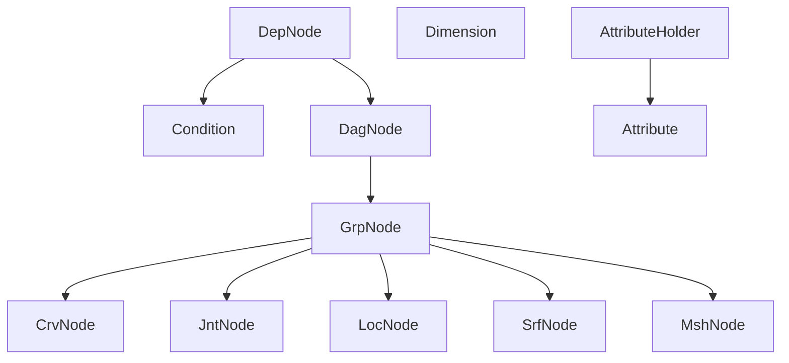
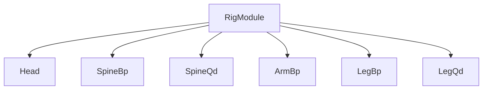
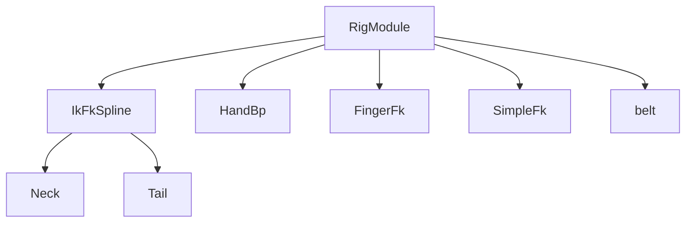

<!--
<style>
table {
    border-collapse: collapse;
}
table, th, td {
   border: 2px solid black;
}
blockquote {
    border-left: solid blue;
	padding-left: 10px;
}
</style>
-->

# nl-rigging-tools ( nlRT )

[](https://www.gnu.org/licenses/agpl-3.0)
[](http://www.nickyliu.com)

 

## Declaimer
> Note that the project is still under active development so please do not use it in production. 

## Background

In my last job I encountered a project involving character setup with Ziva muscle. The very first step was to rig the skeleton mesh as the input of simulation. It required unusual skills like building IK with backward initial knee, bone offset for correct anatomy ... Isn't it cool if my rigging tool could support skeleton for every vetebrate ? Look like a great way to learn anatomy and apply python fully.

Here are some features I am trying to include: 

- **Modular :** No more silly building the whole and deleting unwanted.
- **Skeleton :** Support skeleton meshes (and then simulation).
- **Cartoony :** Setup of bendy limbs.
- **Data Reuse :** Avoid redundant work of editing presets, controls, proxies, weights.
- **Custom Marking Menus :** Popup menus for repetitive tasks.
- **Custom Framework :** Clearer system design.

## Marking Menus

|Rig Build|General|
|:-:|:-:|
|Ctrl + MMB|Ctrl + Alt + MMB|
|||

## Installation

1. Download and extract to a dedicated location.
2. Find "install_by_drag_n_drop.py". Drag and drop it onto Maya viewport.

The tool UI will show up and "nlRT" appears in the Maya main menu.


## Typical Workflow
1. Set character directory.
2. Load character model.
3. For skeleton character, select bones / groups to create reference points.

    > For side reference points (light blue) place them roughly where the closest bind joint will be used. For axial bones, move the point to exact rotation pivot. 

4. Load guides or preset. Fit the guide points to the character.
5. Build the rig. "Toggle guide" and rebuild until the joint position is satisfactory.
6. For skeleton character, click "sk bind" to bind
7. For usual character, show proxy and fit them to warp mesh for binding with proxy.
8. Fix skin weight.
9. Fit controls shape.

<br>

Default files are loaded if the naming rule is followed. ( The number is for versioning. The largest will be loaded if found. )

```
e.g. For folder "horse",

horse_mdl2.ma           # model
horse_ref5.ma           # bone ref 
horse_tpl2.json         # guide template
horse_prx3.ma           # proxy
horse_ctl2.ma           # control
horse_hlp3.ma           # helper
horse_twk.ma            # tweak
weight/horse_wgh.json   # skin weight
```

## Custom Objects Classes


```python
# EXAMPLE USE
from nl_modules.nodel.grp_node import GrpNode
from nl_modules.nodel.jnt_node import JntNode
from nl_modules.nodel.crv_node import CrvNode
from nl_modules.nodel.srf_node import SrfNode

grp = GrpNode("newGrp")  # new group 'newGrp'
jnt = JntNode("newJnt")  # new joint 'newJnt'
crv = CrvNode("newCrv")  # new nurbs curve 'newCrv'
srf = SrfNode("newSrf")  # new nurbs surface 'newSrf'

crv.weightTo([jnt])  # bind jnt to crv
srf.weightTo([jnt])  # bind jnt to srf

grp.a.t.set(0, 10, 0)  # set position
jnt.alignTo(grp)  # align jnt to grp
jnt.addOffsetGrp()  # add offset group for jnt
```

## Custom Component Classes




## Dev Environment
- Maya 2023.3 & 2027.2 
- Windows 11 Pro
- VsCode

## Reference
1. [Python for Maya : Beginner to Advanced Rigging Automation by Nick Hughes](https://www.udemy.com/course/python-for-maya-beginner-to-advanced-rigging-automation)

    I really recommend this tutorials. He shows how a framework can be built to make development efficient and professional. I find it important but rarely taught in many other courses.

2. [Ramon Arango's rigs](https://ramonarango.gumroad.com/)
3. [BoneClones](https://boneclones.com/category/all-zoology-skeletons/fields-of-study)
4. [Ivlpaleontology](https://sketchfab.com/ivlpaleontology)
5. [Vertebres3d](https://www.vertebres3d.fr)


<br>

Visit my blog at [https://www.nickyliu.com](https://www.nickyliu.com)
