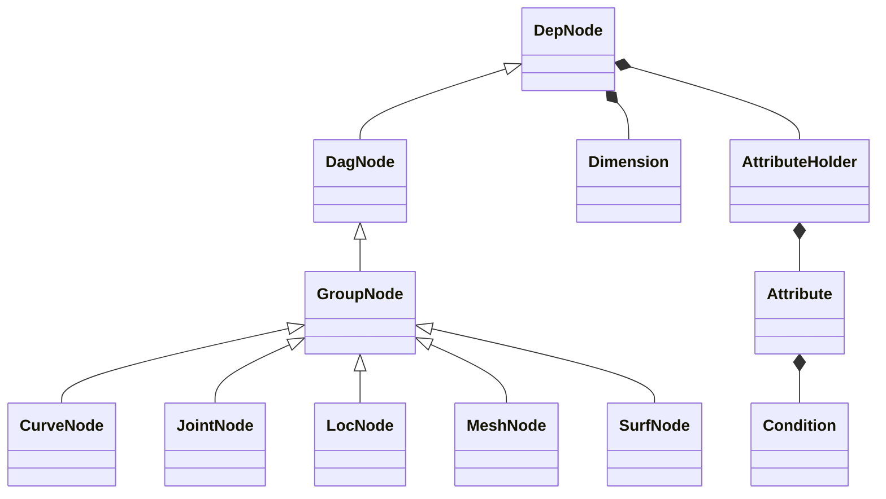
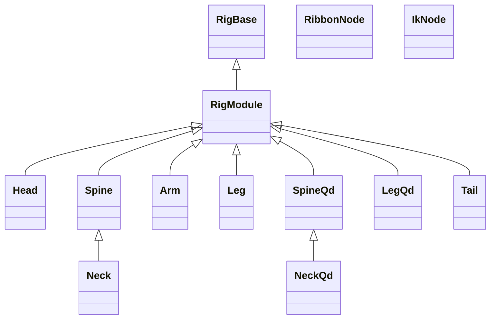

# nl-rigging-tools

## Intro
The origin of the development is because of the few ziva animation rigs I once used in a project. I found a few interesting techniques and tricks in rigging the actual "skeleton". So a auto rigging tool for skeleton would be great as the first step of creature creation with muscles ...

I have been writing autorigs with MEL and Maxscript for years but not in Python. Thanks to the great sharing of Nick Hughes in his Udemy course <b>"Python for Maya: Beginner to Advanced Rigging Automation"</b>, I learn the proper way of tools dev using custom framework.


## Features
### Components
#### Neck / Spine
- FK > IK > Ribbon
- Stretchy with volume control
#### Arm
- FK / IK with ribbon
- Auto clavicle
- Soft IK
- Elbow pinning
- Free / aligned wrist
- Twist bones
#### Hand
- Smart finger control
- Palm roll control
- Scalable hand
#### Leg
- FK / IK with ribbon
- Auto hip
- Soft IK
- Knee pinning
- Twist bones
- Toe & Patella bones
- Knee correction
- Smart foot roll control
- Scalable foot
#### NeckQd / SpineQd
- IK > FK > Ribbon
- Stretchy with volume control
#### LegQd
- FK / IK with ribbon
- Smart foot roll control


## Framework Classes



## Component Classes



## Marking menus

#### Rig Operation ( ctrl + MMB )

#### General Rigging ( ctrl + alt + MMB )


## Installation
1. Download the repository zip file.
2. Extract it.
3. Locate install/dragAndDrop.py.
4. Drag and drop it onto a Maya viewport.
5. Run the lines
    ```python
    from nl_modules import nl_rigging_tools
    nl_rigging_tools.main()
    ```

## Support
For more information, visit my blog at [www.nickyliu.com](http://www.nickyliu.com)