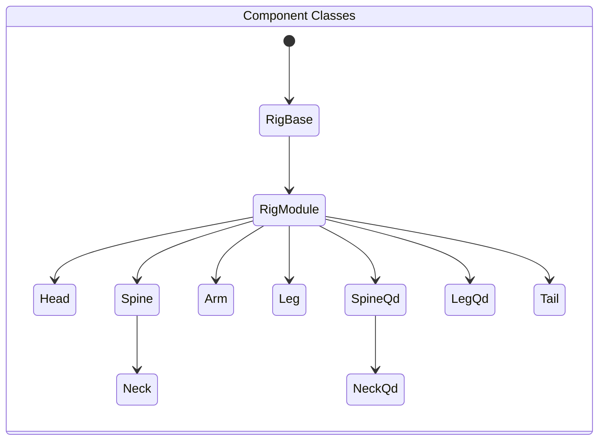
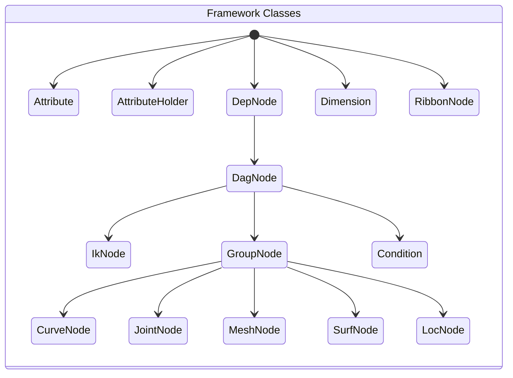

## N-Rig

Another modular rigging system in Python for Autodesk Maya, with the core values for animators:

- Intuitive:&emsp;Too many things at a time is scary.
- Effective:&emsp;No animator I know enjoy waiting for playback.
- Modular:&emsp;Animators will break it badly otherwise.
- Fun:&emsp;&emsp;&emsp;Isn't it great ?


The system was built based on a custom rigging framework. Thanks to the rigging course by <i><b>Nick Hughes</b></i> which opens my eyes and shows me the proper way to go without pymel.

## Installation

1. Download the repository zip file

2. Extract the contents

3. Locate install/dragAndDropMe.py

4. Drag and drop this file into a Maya viewport.


## Usage
```python
from nl_modules import nl_rigging_tools
from importlib import reload
reload(nl_rigging_tools)
nl_rigging_tools.main()
```

## Framework & Components Classes



### Example use

```python
headObj = Head('head0_RGN')
headObj.genSk()
headObj.build()
```



### Example use

```python
crv = CurveNode('myCurve')
jnt = JointNode('myJoint')
msh = MeshNode('myMesh')
srf = SurfNode('mySrf')
loc = LocNode('myLoc')
obj = DagNode('obj')

objA.a.tx + objB.a.tｘ >> objC.a.tx
```

## Marking Menus

#### Marking menu for autorig ( ctrl + MMB )


#### Marking menu for general rigging ( ctrl + alt + MMB )


