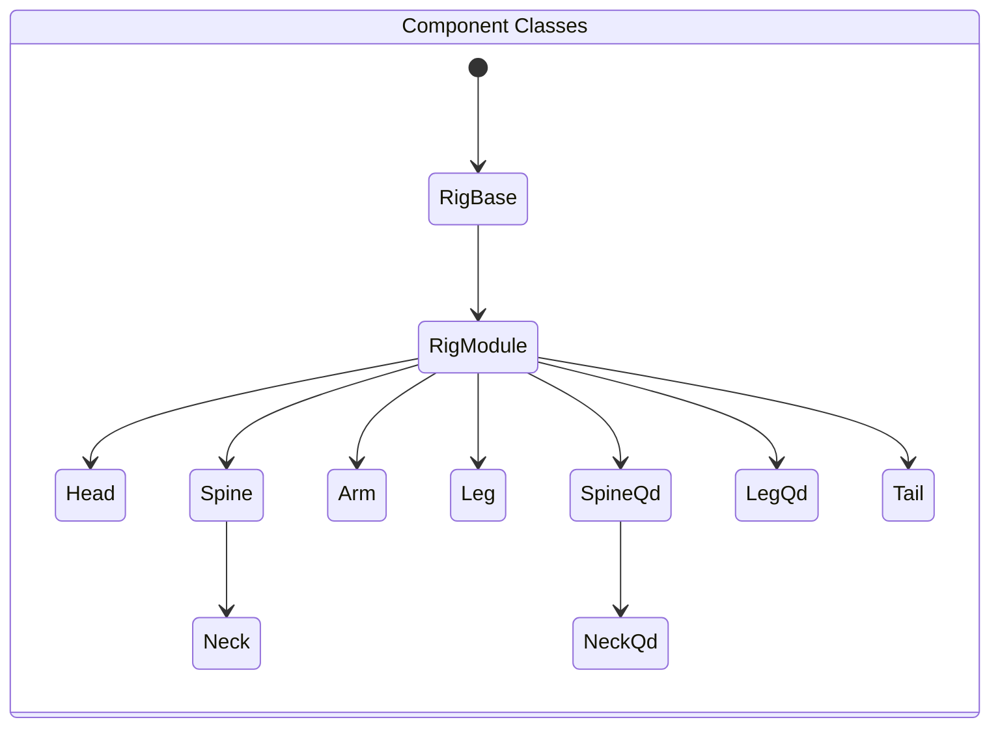
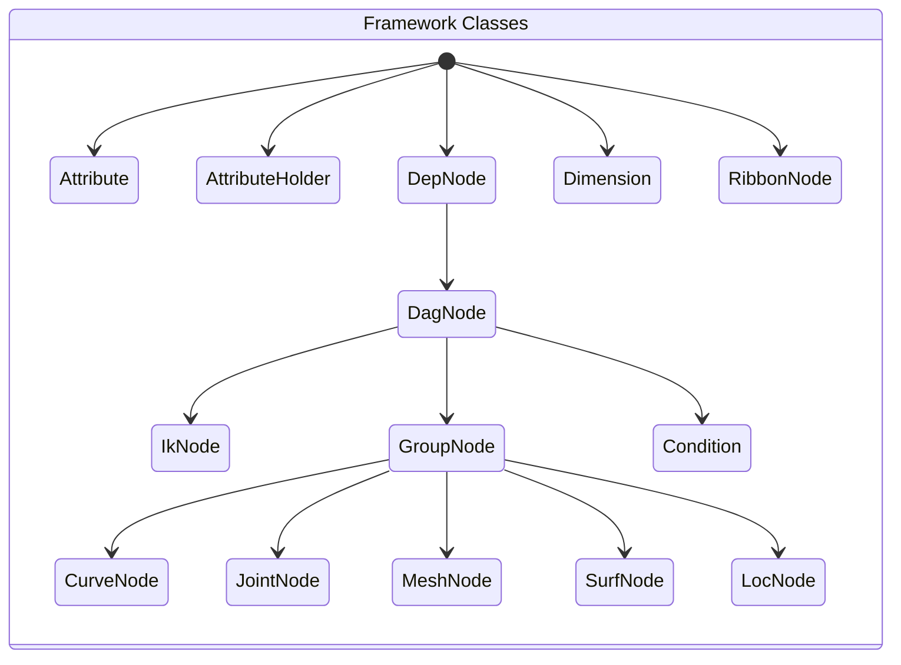

## Chi-Auto-Rigger (CaR)
It is another open-source modular auto-rigger written for Autodesk Maya in Python.

There are a few great auto-rigger tools available online. As a rigger I'm interested in building my own.

Thanks to the Udemy course <b>Python for Maya: Beginner to Advanced Rigging Automation</b> by <b>Nick Hughes</b>, my tools are built with custom framework which speed up development without dependency on PyMEL.

## Installation
1. Download the repository zip file
2. Extract the contents
3. Locate install/dragAndDropMe.py
4. Drag and drop this file onto a Maya viewport.

## Usage

```python
from nl_modules import nl_rigging_tools
from importlib import reload
reload(nl_rigging_tools)
nl_rigging_tools.main()
```

## Framework & Components Classes



### Example use

```python
headObj = Head('head0_RGN')
headObj.genSk()
headObj.build()
```



### Example use

```python
crv = CurveNode('myCurve')
jnt = JointNode('myJoint')
msh = MeshNode('myMesh')
srf = SurfNode('mySrf')
loc = LocNode('myLoc')
obj = DagNode('myObj')
```

## Marking Menus

#### Marking menu for autorig ( ctrl + MMB )


#### Marking menu for general rigging ( ctrl + alt + MMB )


