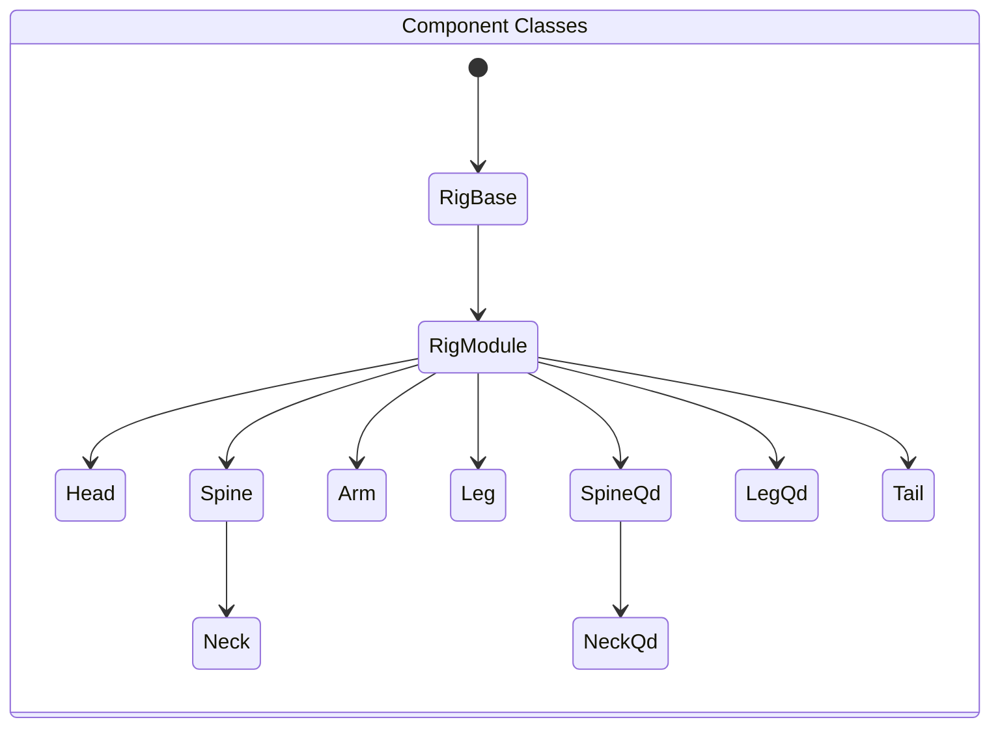
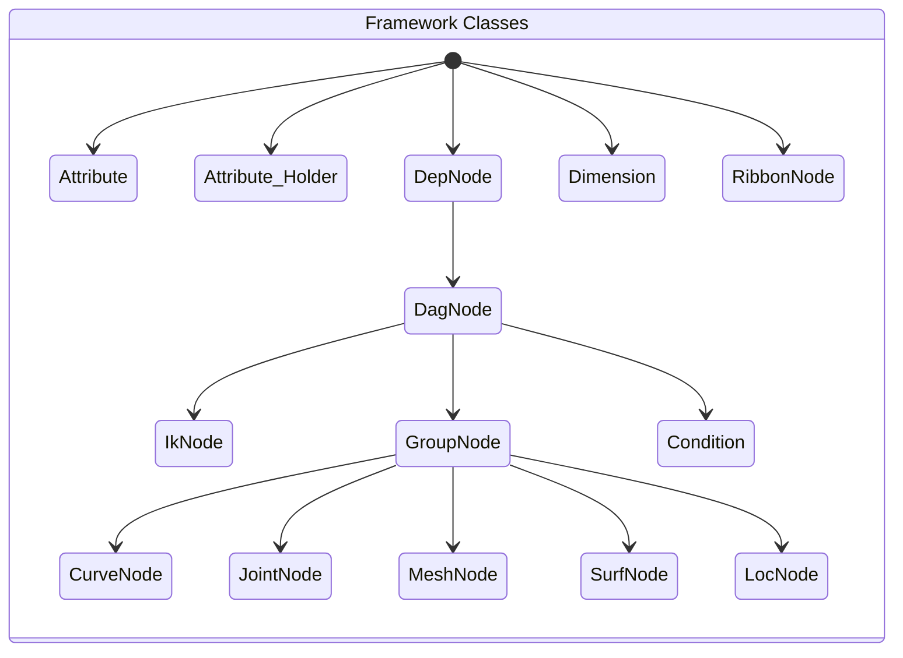

# nl_rigging_tools

This is another modular auto rigging tools written in Python for Maya. I try to make it as intuitive as possible and

- allow modular rebuild
- support anatomical models

The tool is built efficiently with custom framework which is not planned ahead. Thanks to the Udemy Course <b>Python for Maya Beginner to Advanced Rigging Automation</b> by Nick Hughes, it opens my eyes and shows me the proper way to go without pymel.

## Usage

```
from nl_modules import nl_rigging_tools
from importlib import reload
reload(nl_rigging_tools)
nl_rigging_tools.main()
```

## Framework & Components Classes



### Example use

```
headObj = Head('head0_RGN')
headObj.genSk()
headObj.build()
```



### Example use

```
crv = CurveNode('myCurve')
jnt = JointNode('myJoint')
msh = MeshNode('myMesh')
srf = SurfNode('mySrf')
loc = LocNode('myLoc')
obj = DagNode('obj')

objA.a.tx + objB.a.tｘ >> objC.a.tx
```

## Marking Menus

#### Marking menu for autorig ( ctrl + MMB )


#### Marking menu for general rigging ( ctrl + alt + MMB )


