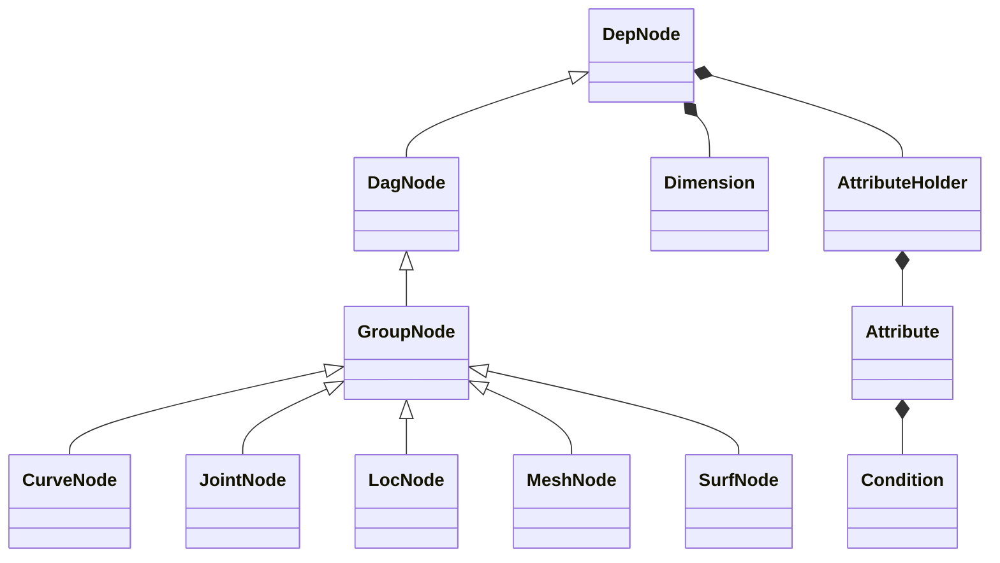
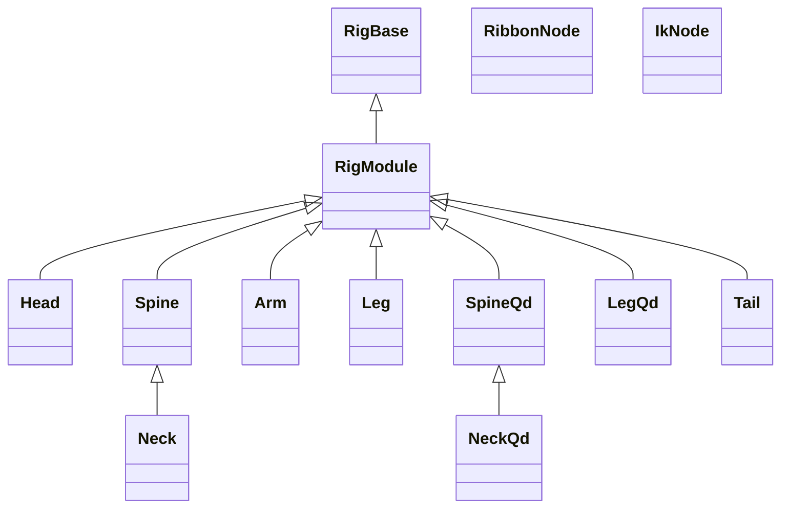

# nl-rigging-tools

## Background
For years, I have been rigging characters with my own autorigger . Once in a project I was using Ziva and find it interesting rigging the actual "skeleton". Meanwhile I would like to apply python and learn more about anatomy through the project.

## Overview

nl-rigging-tools is designed with the following key features in mind :
- <b>Modular : </b>Support character with any number of parts
- <b>Auto Connect : </b> Each part has it's own in / out plug. Connections made according to distance in each build.
- <b>Serialization : </b> Templates / proxies / control shapes can be saved and restored.
- <b>Custom Framework : </b> I was about to use PyMel at the beginning. Thanks to Nick Hughes' Udemy course, "Python for Maya: Beginner to Advanced Rigging Automation" I learn a better way of development and building concise code.
- <b>Auto binding for skeleton meshes : </b> The number of bones


## Framework Python Classes


## Component Python Classes



## Components Features

Part | FK | IK | Ribbon | Stretchy | Volume | Soft Ik | Pv Pin | Twist bones | Palm Roll | Patella Bone 
--- | --- | --- | --- | --- | --- | --- | --- | --- | --- | --- 
Head |+|||||||||
Spine |+|+|+|+|+|||
Hand |+|+|+|+||||||
Arm |+|+|+|+|+|+|+|+||
Leg |+|+|+|+|+|+|+|+|+|+
Tail |+|+|+|+||||||


## Marking menus
Two Marking menus are made to speed up rigging work.
|Menu|Shortcut|UI|
|---|---|---|
|Rig Building |Ctrl + MMB||
|Daily Rigging Operations|Ctrl + Alt + MMB| |


## Installation
1. Download the repository zip file.
2. Extract it.
3. Locate install / dragAndDrop.py.
4. Drag and drop it onto a Maya viewport.
5. Run the lines
    ```python
    from nl_modules import nl_rigging_tools
    nl_rigging_tools.main()
    ```

## More Info
Please visit my blog at [www.nickyliu.com](http://www.nickyliu.com)


## Reference
[BoneClones](https://boneclones.com/category/all-zoology-skeletons/fields-of-study)