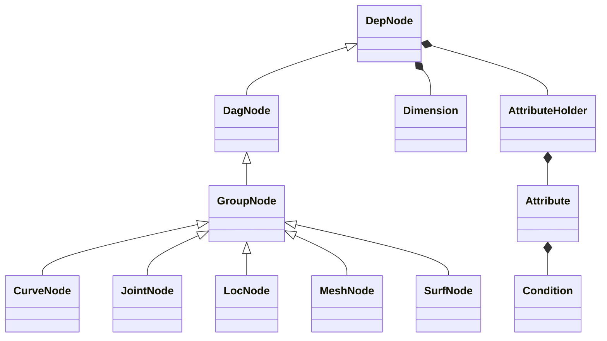
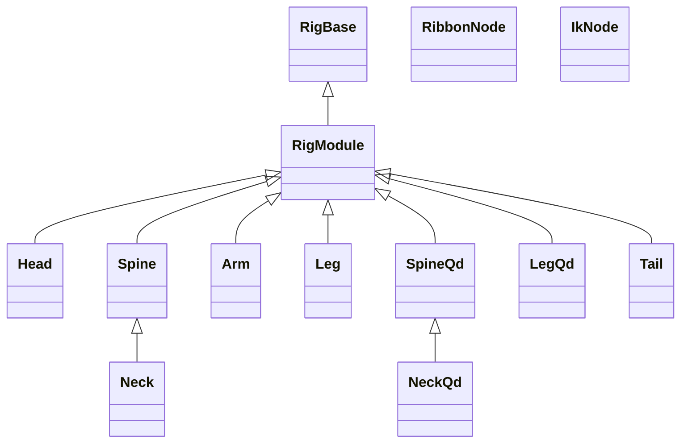

# nl-rigging-tools ( nlRT )

## Background
Once in a while I used Ziva intensively in a project. Rigging the actual skeletonal meshes was challenging and I found it a good opportunity to learn anatomy while building the automation tool.

## Overview
nlRT is designed with the key features below :
- <b>Modular | </b>Character can have any number of parts
- <b>Data Reuse | </b> Templates, controls and proxies can be saved and retored.
- <b>Auto Connect | </b> Parts are automatically connected  according to distance between anchors.
- <b>Auto Bind | </b> Skeletal meshes are auto bound with ref or ribbon joints added.
- <b>Concise code | </b> Thanks to Nick Hughes' Udemy course, "Python for Maya : Beginner to Advanced Rigging Automation", I use custom framework to shorten tools development time and difficulty.

## Framework Python Classes


## Component Python Classes



## Components Features

Part | FK | IK | Ribbon | Stretchy | Volume | Soft Ik | Pv Pin | Twist bones | Palm Roll | Patella Bone | Scale
--- | --- | --- | --- | --- | --- | --- | --- | --- | --- | --- | ---
Head |*||||||||||*
Spine |*|*|*|*|*|||
Qd Spine |*|*|*|*|*|||
Hand |*|*|*|*|||||||*
Arm |*|*|*|*|*|*|*|*||
Leg |*|*|*|*|*|*|*|*|*|*
Qd Leg |*|*|*|*|*|*|*|*|*|*
Tail |*|*|*|*|||||||*


## Marking menus
Two Marking menus are made to speed up rigging work.
|Menu|Shortcut|Capture|
|---|---|---|
|Rig Building |Ctrl + MMB||
|Daily Rigging Operations|Ctrl + Alt + MMB| |


## Installation
1. Download the repository zip file.
2. Extract it.
3. Locate install / dragAndDrop.py.
4. Drag and drop it onto a Maya viewport.
5. Run the lines
    ```python
    from nl_modules import nl_rigging_tools
    nl_rigging_tools.main()
    ```

## More Info
Please visit my blog at [www.nickyliu.com](http://www.nickyliu.com)


## Reference
[BoneClones](https://boneclones.com/category/all-zoology-skeletons/fields-of-study)
