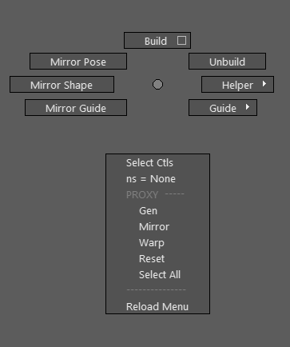
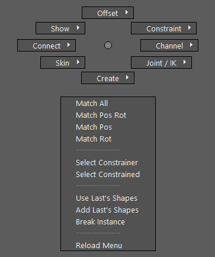
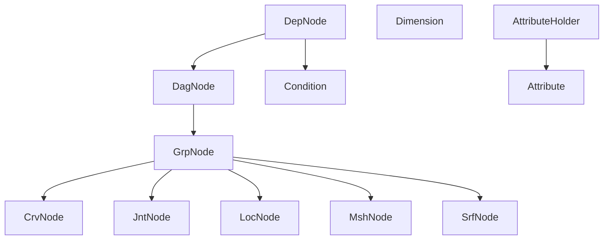
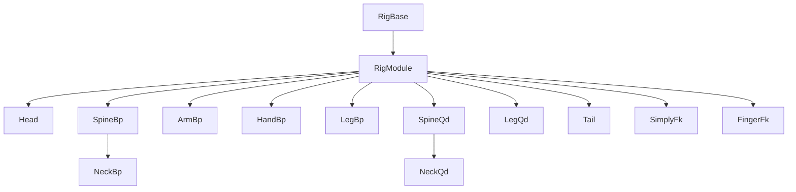

<!--
<style>
table {
    border-collapse: collapse;
}
table, th, td {
   border: 2px solid black;
}
blockquote {
    border-left: solid blue;
	padding-left: 10px;
}
</style>
-->

# nl-rigging-tools ( nlRT )    


[](http://www.nickyliu.com)

 


## Background

In my last job I encountered a project with characters involving Ziva muscle setup. The very first step was to rig the skeleton mesh  as an input of simulation. It required unusal skill that was inspirating to me. It would be great to build an autorig tool for every vetebra on Earth. And I can learn anatomy in a practical way, and apply python along ...


## Features

- **Modular :** Support multiple limbs.
- **Skeletal :** Support skeleton rigging.
- **Cartoony :** Support bendy limbs.
- **Data Reuse :** Reuse of templates, controls, proxies, weights.
- **Custom Marking Menus :** Handy menus for rig creation.
- **Custom Framework :** Less redundant code for rig development.

## Marking menus

|nl Rig Tool|General Tasks|
|-|-|
|Ctrl + MMB|Ctrl + Alt + MMB|
|||

## Installation

1. Download and extract to your target location.
2. Drag and drop "nl_rigging_tools_drag.py" onto Maya. "nlRT" will be added into Maya main menu and the tool UI will show up.

You can add icon to the active shelf by "More > Add Icon to Current Shelf" in the tool UI.

## Usage

Files are read with the naming convention.  
e.g.

`horse`  
&emsp;`  horse_mdl*.ma`  
&emsp;`  horse_tpl*.json`  
&emsp;`  horse_ctl*.ma`  
&emsp;`  horse_prx*.ma`  
&emsp;`  weight`  
&emsp;&emsp;&emsp;`  horse_wgh*.json`  

> Note that "*" can be any number where the largest will be loaded

Typical Workflow
1. Set the character directory.
2. Load the model.
3. Create guides and fit into the model.
4. Build rig.
5. Gen proxy (For preview or skinning).
6. Skin using proxy.
7. Edit control shapes.

## Custom Objects Classes

```python
# Example
from nl_modules.nodel.grp_node import GrpNode
from nl_modules.nodel.jnt_node import JntNode
from nl_modules.nodel.crv_node import CrvNode
from nl_modules.nodel.srf_node import SrfNode

grp = GrpNode('newGrp')
jnt = JntNode('newJnt')
crv = CrvNode('newCrv')
srf = SrfNode('newSrf')

crv.weightTo([jnt])
srf.weightTo([jnt])

grp.a.t.set(0,10,0)
jnt.alignTo(grp)
jnt.addOffsetGrp()
```
## Custom Component Classes

```python
# Example
from nl_modules.build.leg_bp import LegBp

cpn = LegBp('lfLegBp0_RGN')
cpn.gen_sk()
cpn.build()
```

## Dev Environment
| Maya | Python | OS |
|:-:|:-:|:-:|
|2023.3 |3.9.7|Win 11

## Reference
1. [Python for Maya : Beginner to Advanced Rigging Automation by Nick Hughes](https://www.udemy.com/course/python-for-maya-beginner-to-advanced-rigging-automation)
2. [Ramon Arango's rigs](https://ramonarango.gumroad.com/)
2. [BoneClones](https://boneclones.com/category/all-zoology-skeletons/fields-of-study)
3. [Ivlpaleontology](https://sketchfab.com/ivlpaleontology)

##
Visit my blog at [https://www.nickyliu.com](https://www.nickyliu.com)
