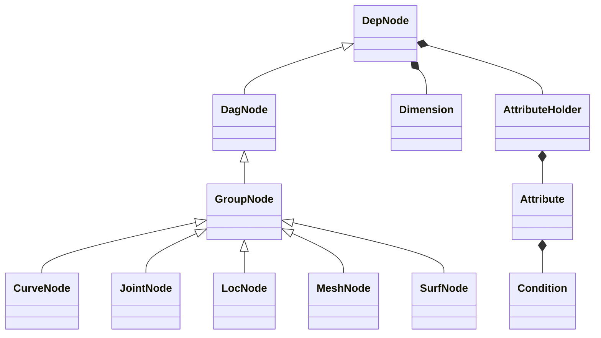
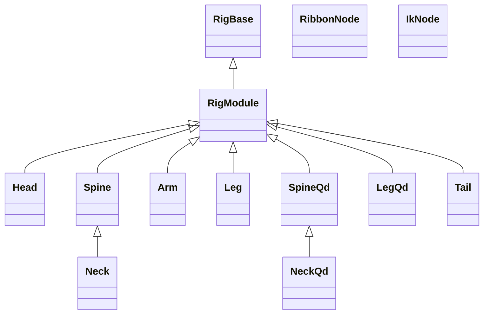

# nl-rigging-tools (NRT)
### What ?
It is another open-source modular auto-rigger written for Autodesk Maya in Python.

There are a few great auto-rigger tools available freely online. As a rigger I'm interested in building my own. I have scripted a few in Maya with MEL and in 3dsMax with maxscript. Python allows more possibility and I hope it's not too late to learn and apply it :blush:

One cool thing I learn throughout the development is the use of custom framework. Thanks to the Udemy course <b>"Python for Maya: Beginner to Advanced Rigging Automation"</b> by Nick Hughes, my code is more concise, faster to read, and independent on PyMEL.

For example, the lines below generate all utility nodes and connections, but read like expression :fireworks:

```python
# ---------------
#    Soft IK
# ---------------
s = self.ikc.a.soft
Ds = D * (1 - s)
ds = D * (1 - s * math.e ** -(d - Ds))
(((d > Ds).setCdn(ifTrue=ds, ifFalse=d)) * ratio >> softJ.a.tx)
```

## Framework Classes



## Component Classes

## Builder Features
* Modular
* Individual rebuild
* Automatic linkage and space switch target update

## Rig Features
General
* Scalable

Biped Spine
* hybrid fk/ik
* squash/stretch
* lower hip ctl
* volume ctl

Biped Limbs
* fk/ik
* squash/stretch
* space switch
* soft ik
* smart ctl
* elbow/knee pin with fk ctl
* auto clavicle/hip
* palm roll/bank
* -------- ( Optional ) --------
* ribbon ctl
* twist bones
* patella bone
* toe bones
* knee correction

Quad Spine
* squash/stretch

Quad Limbs
* fk/ik
* squash/stretch
* space switch
* -------- ( Optional ) --------
* twist bones
* patella bone
* toe bones
* wrist correction

## Marking Menus

#### Rig Operation ( ctrl + MMB )

#### General Rigging ( ctrl + alt + MMB )


## Installation
1. Download the repository zip file.
2. Extract to storage location.
3. Locate install/dragAndDrop.py.
4. Drag and drop it onto a Maya viewport.
5. Run the lines below
    ```python
    from nl_modules import nl_rigging_tools
    nl_rigging_tools.main()
    ```

## To do

* Study matrix for more efficient constraint calculation.
* Understand more about how professional animators work.
* Visit my blog at [nickyliu.com](http://www.nickyliu.com) for more information.